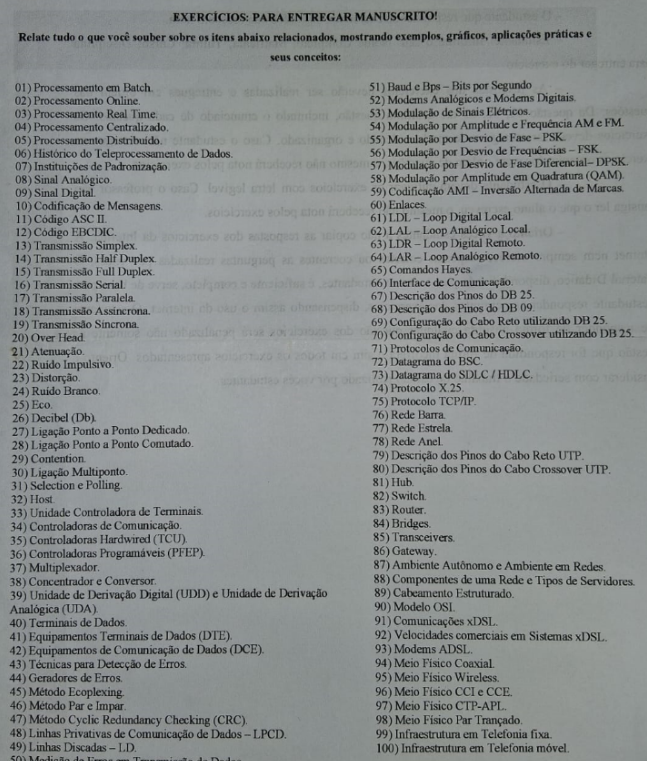

# Conceitos Fundamentais de Redes e Telecomunicações

## Introdução

Fiz isso para me ajudar nos meus estudos de Redes, já que meu professor me passou esse trabalho abaixo:

  

E sim infelizmente eu tive que escrever tudo isso a mão, acredite deu mais de 80 folhas de caderno >:(

---

### 1. Conceitos Introdutórios e Históricos
*   [[Histórico_de_Teleprocessamento_de_Dados]]
*   [[Instituições_de_Padronização]]

### 2. Tipos de Processamento
*   [[Processamento_em_Batch]]
*   [[Processamento_Online]]
*   [[Processamento_Real_Time]]
*   [[Processamento_Centralizado]]
*   [[Processamento_Distribuido]]

### 3. Sinais e Codificação
*   [[Sinal_Analógico]]
*   [[Sinal_Digital]]
*   [[Codificação_de_Mensagens]]
*   [[Código_ASCII]]
*   [[Código_EBCDIC]]
*   [[Baud_e_Bps_–_Bits_por_Segundo]]
*   [[Largura_de_Banda]]
*   [[Decibel_(Db)]]

### 4. Modos e Tipos de Transmissão
*   [[Transmissão_Simplex]]
*   [[Transmissão_Half_Duplex]]
*   [[Transmissão_Full_Duplex]]
*   [[Transmissão_Serial]]
*   [[Transmissão_Paralela]]
*   [[Transmissão_Assíncrona]]
*   [[Transmissão_Síncrona]]
*   [[Over_Head]]

### 5. Meios Físicos
*   **Conceitos Gerais:**
    *   [[Meio_Físico]]
    *   [[Meio_Físico_Guiado]]
    *   [[Meio_Físico_Não_Guiado]]
*   **Meios Guiados:**
    *   [[Meio_Físico_Par_Trançado]]
    *   [[Meio_Físico_Coaxial]]
    *   [[Meio_Físico_Fibra_Óptica]]
*   **Meios Não Guiados:**
    *   [[Meio_Físico_Wireless]]
    *   [[Meio_Físico_Rádio]]
    *   [[Meio_Físico_Microondas]]

### 6. Modulação
*   [[Modulação_de_Sinais_Elétricos]]
*   [[Modulação_por_Amplitude_e_Frequência_AM_e_FM]]
*   [[Modulação_por_Desvio_de_Frequência_–_FSK]]
*   [[Modulação_por_Desvio_de_Fase_–_PSK]]
*   [[Modulação_por_Desvio_de_Fase_Diferencial_–_DPSK]]
*   [[Modulação_por_Amplitude_em_Quadratura_(QAM)]]
*   [[Codificação_AMI_–_Inversão_Alternada_de_Marcas]]

### 7. Qualidade e Erros na Transmissão
*   [[Atenuação]]
*   [[Distorção]]
*   [[Ruído_Impulsivo]]
*   [[Ruído_Branco]]
*   [[Eco]]
*   [[Técnicas_para_Detecção_de_Erros]]
*   [[Método_Ecopelexing]]
*   [[Método_Par_e_Ímpar_(Paridade)]]
*   [[Método_Cyclic_Redundancy_Checking_(CRC)]]
*   [[Geradores_de_Erros]]
*   [[Medição_de_Erros_em_Transmissão_de_Dados]]

### 8. Topologias e Tipos de Rede
*   **Tipos de Ligação:**
    *   [[Ligação_Ponto_a_Ponto_Dedicado]]
    *   [[Ligação_Ponto_a_Ponto_Comutado]]
    *   [[Contention]]
    *   [[Ligação_Multiponto]]
    *   [[Selection_e_Polling]]
*   **Topologias Físicas/Lógicas:**
    *   [[Rede_Ponto_a_Ponto]]
    *   [[Rede_Barra]]
    *   [[Barramento]]
    *   [[Rede_Anel]]
    *   [[Rede_Estrela]]
    *   [[Rede_Híbrida]]
*   **Escopo Geográfico:**
    *   [[Redes_Locais_(LAN)]]
    *   [[Redes_Metropolitanas_e_de_Longa_Distância_(MAN_e_WAN)]]

### 9. Equipamentos de Rede e Interconexão
*   **Dispositivos Finais e de Acesso:**
    *   [[Host]]
    *   [[Terminais_de_Dados]]
    *   [[Equipamentos_Terminais_de_Dados_(DTE)]]
    *   [[Equipamentos_de_Comunicação_de_Dados_(DCE)]]
    *   [[Modems_Analógicos_e_Modems_Digitais]]
    *   [[Comandos_Hayes]]
*   **Controladoras e Concentradores:**
    *   [[Unidade_Controladora_de_Terminais]]
    *   [[Controladoras_de_Comunicação]]
    *   [[Controladoras_Hardwired_(TCU)]]
    *   [[Controladoras_Programáveis_(PFEP)]]
    *   [[Multiplexação]]
    *   [[Concentrador_e_Conversor]]
    *   [[Unidade_de_Derivação_Digital_(UDD)_e_Unidade_de_Derivação_Analógica_(UDA)]]
*   **Dispositivos de Interconexão (Camadas 1-3):**
    *   [[Repetidor]]
    *   [[Hub]]
    *   [[Bridge]]
    *   [[Switch]]
    *   [[Roteador]]
    *   [[Gateway]]
*   **Interfaces e Cabeamento Físico:**
    *   [[Interface_de_Comunicação]]
    *   [[Configuração_dos_Pinos_do_DB_25]]
    *   [[Descrição_dos_Pinos_do_DB_09]]
    *   [[Cabo_Reto_(DB_25)]]
    *   [[Cabo_Crossover_(DB_25)]]

### 10. Enlaces e Linhas de Comunicação
*   [[Enlaces]]
*   [[LDL_–_Loop_Digital_Local]]
*   [[LAL_–_Loop_Analógico_Local]]
*   [[LDR_–_Loop_Digital_Remoto]]
*   [[LAR_–_Loop_Analógico_Remoto]]
*   [[Linhas_Privativas_de_Comunicação_de_Dados_–_LPCD]]
*   [[Linhas_Discadas_–_LD]]

### 11. Protocolos e Modelos de Referência
*   [[Protocolos_de_Comunicação]]
*   [[Adaptação_do_SDLC_-_HDLC]]
*   [[Protocolo_X.25]]
*   [[Protocolo_TCP-IP]]
*   [[Modelo_de_Referência_OSI]]
*   [[Modelo_TCP_IP]]